# TraveLogue

– A Django based website where the user community can create blogs and share them among each other.
– Has features to upload photos, like and comment on blogs, to bookmark posts, to follow other bloggers etc.
– Key Technologies used- Django, HTML, CSS, SQLite, JavaScript, AJAX

### Take a tour of website:

## Signup /login page of website:

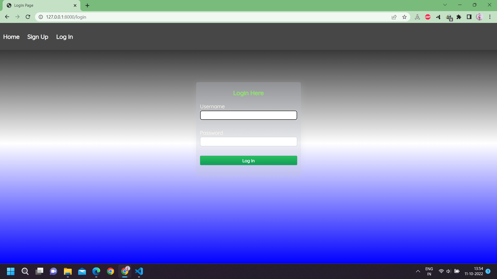
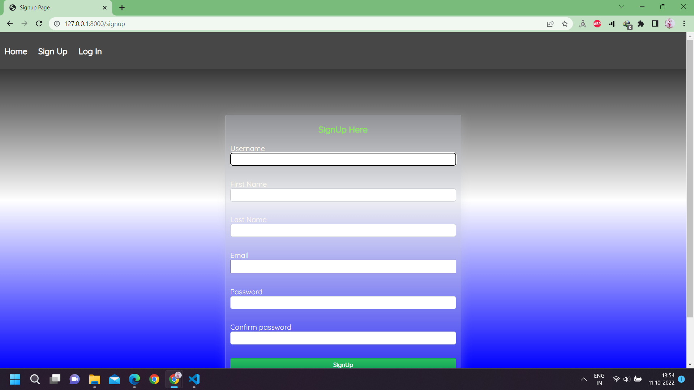

## Home page of website:

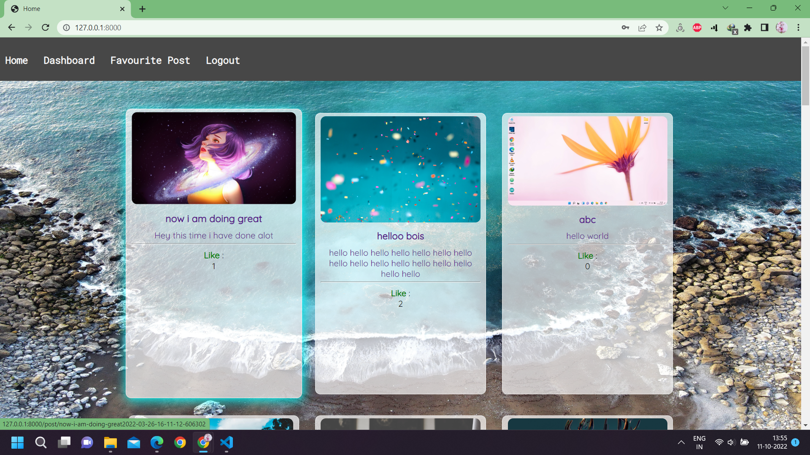
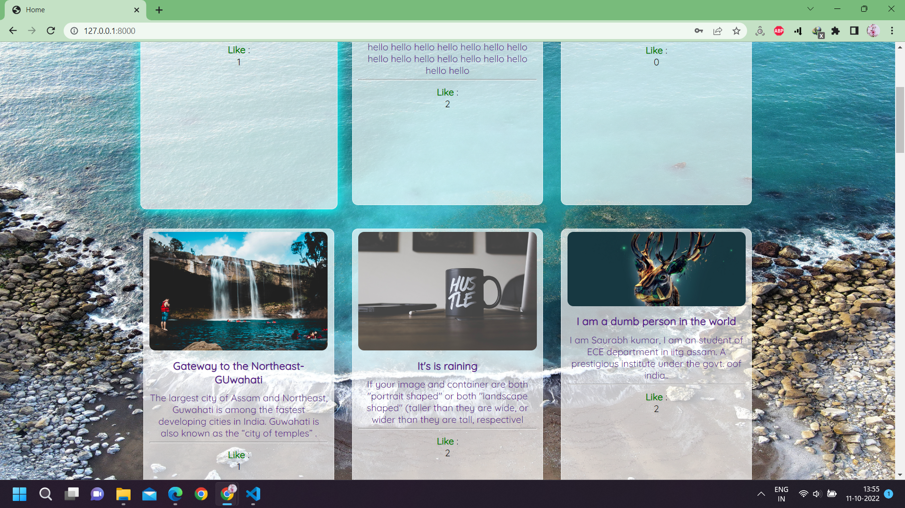

## Personal Dashboard:

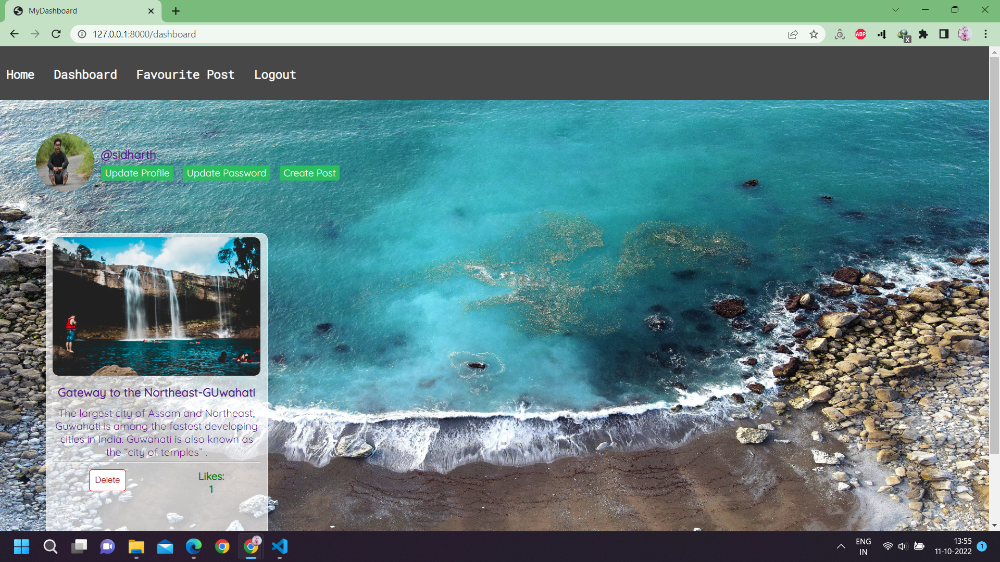

## Bookmarked Blog:

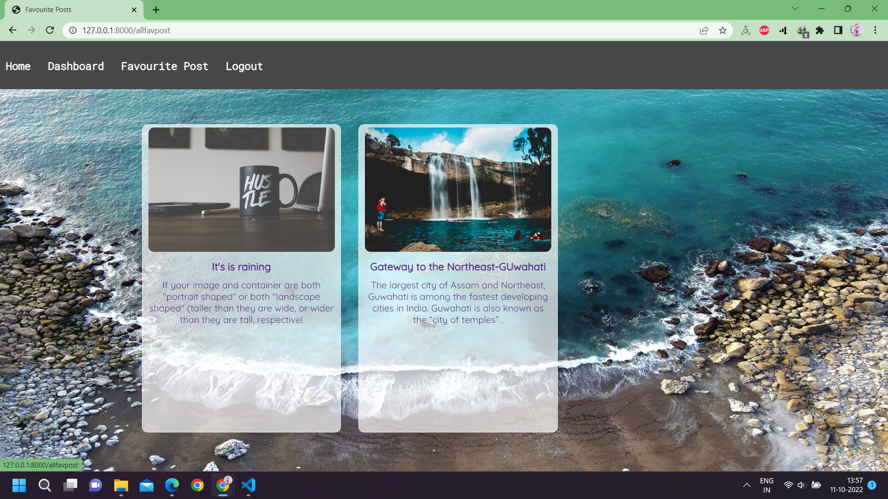

## Personal Mini portfolio page:

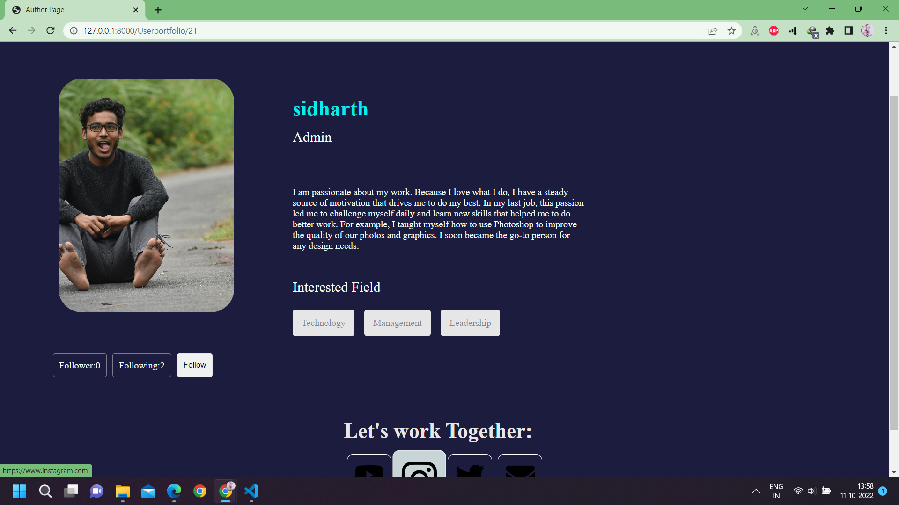
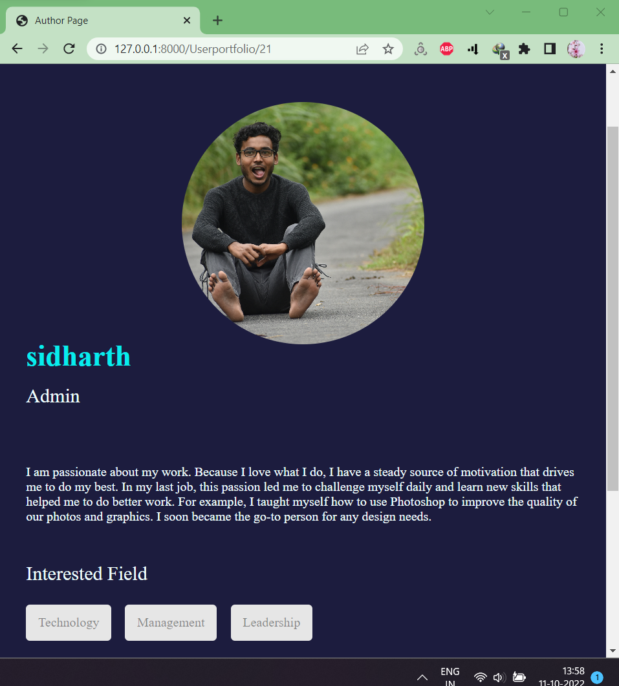

## Creating a Post:

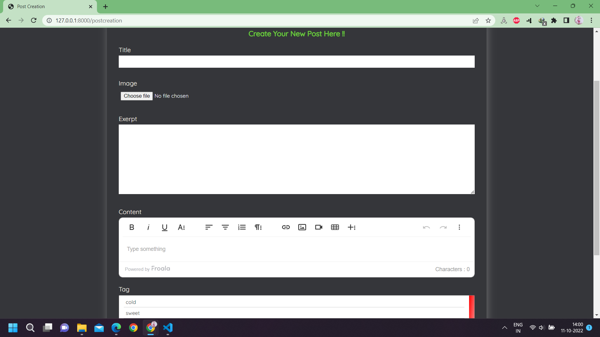

## Updating your Personal Info:

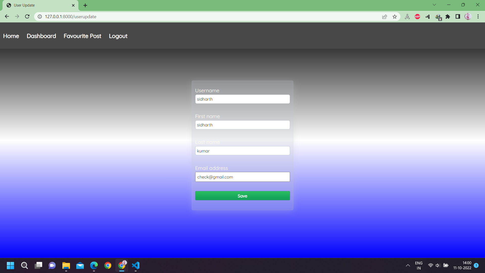

## changing Password:

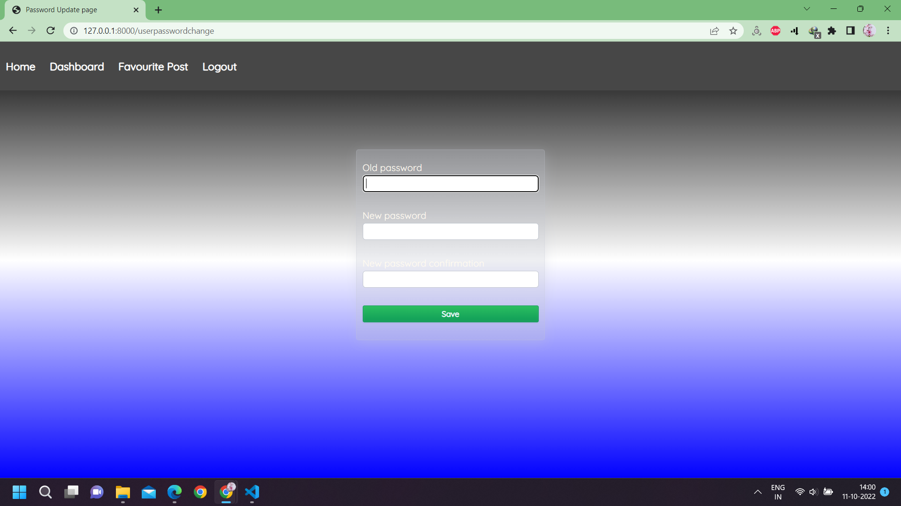

## Deatail form For Generating Personal portfolio page:

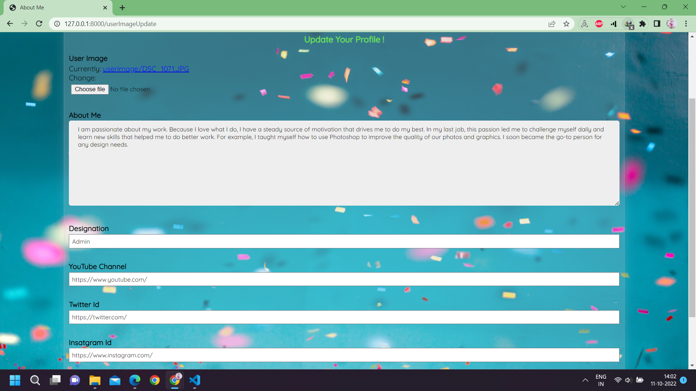

## Post Detail view:

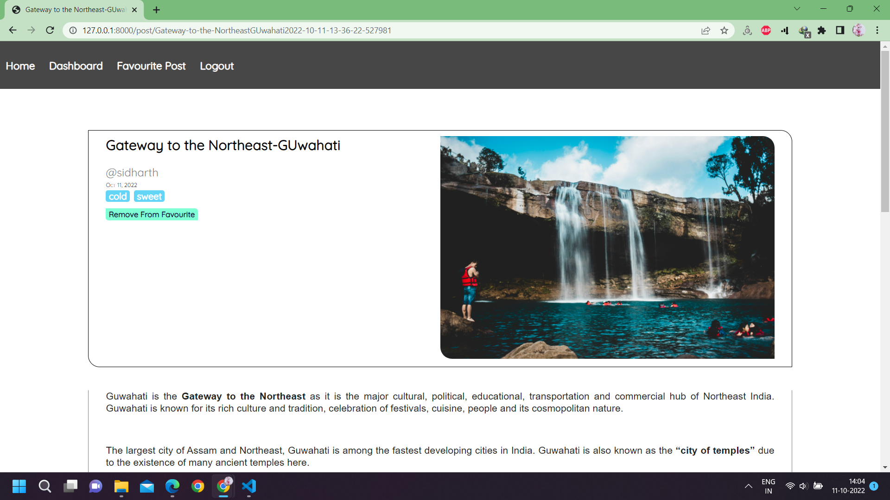
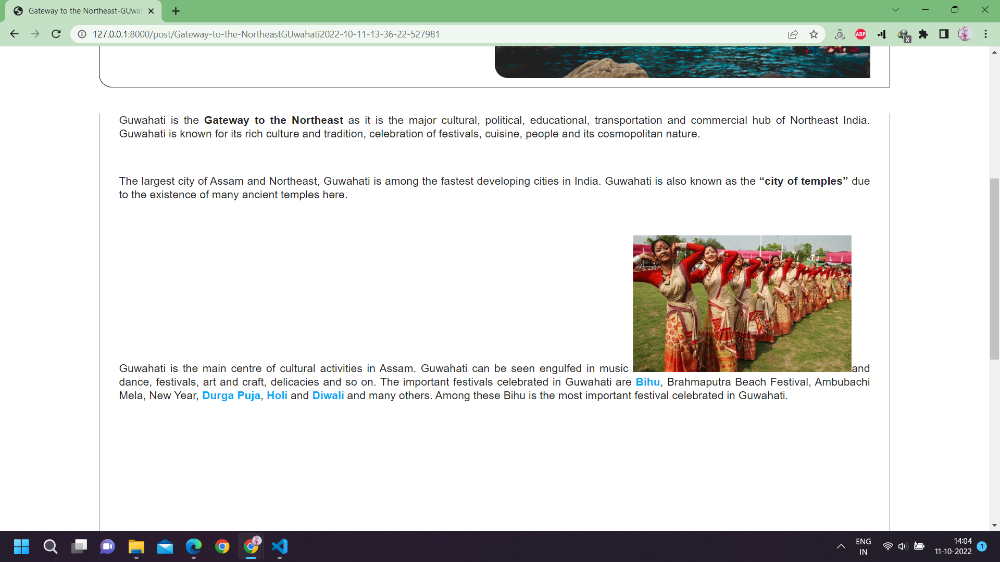
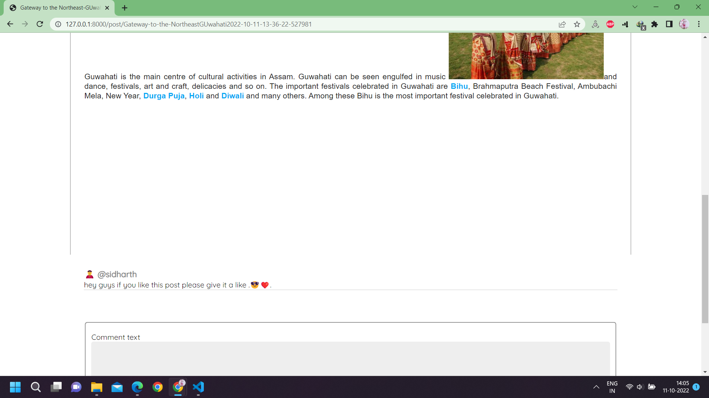
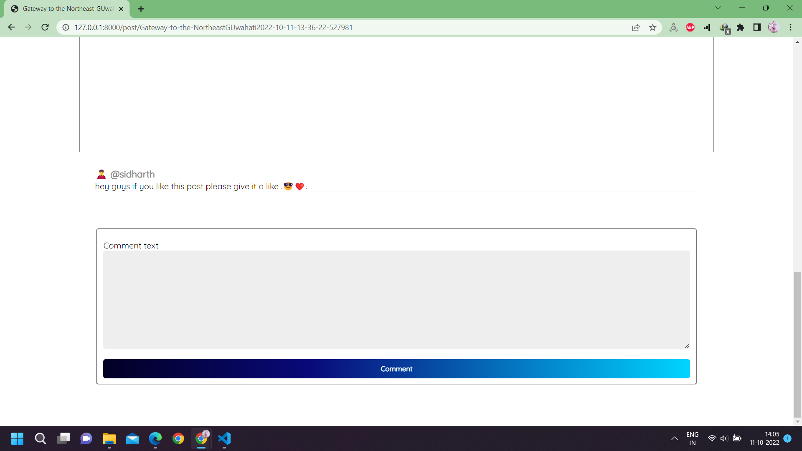

Note- i have used some free images from the unsplash.com 
